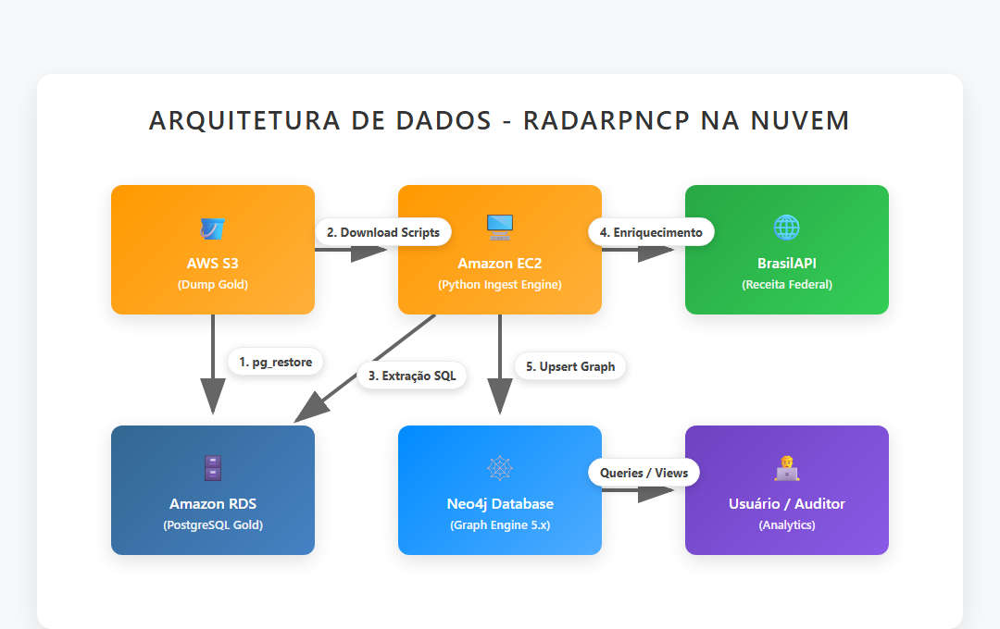
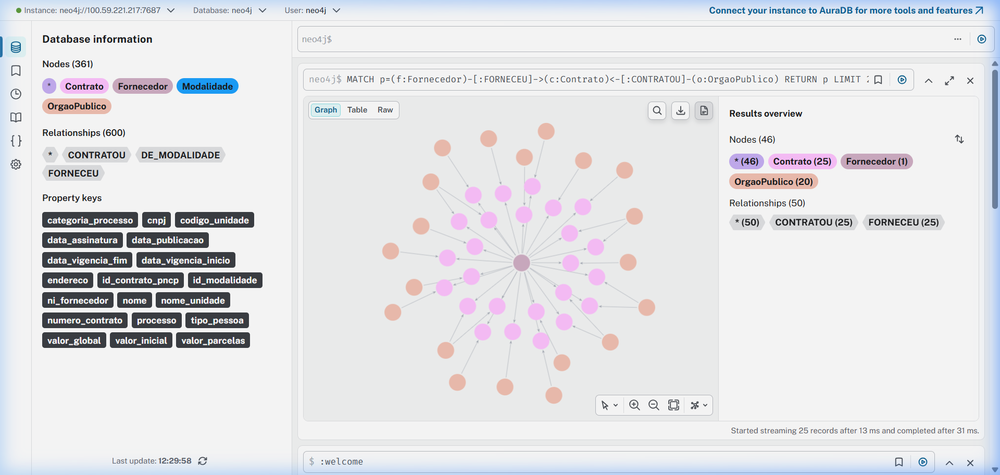

# 🕸️ RadarPNCP — Mapeamento de Redes de Contratação Pública em Grafo

> **Projeto de Especialização em Big Data — Escola Politécnica da USP**

### 🎓 Equipe Acadêmica
- **Disciplina:** Repositórios de Dados e NoSQL (eEDB-016)
- **Docentes:** 
  - Prof. Dr. Pedro Luiz Pizzigatti Corrêa
  - Prof. Dra. Jeaneth Machicao
- **Discentes:** 
  - Antonio Daniel de Souza Linhares
  - Hercules Ramos Veloso de Freitas
  - Yuri Alexandre Barbosa Rodrigues

### 🛠️ Especificações Técnicas
- **Tecnologia NoSQL:** Neo4j (Grafos) — implantado na nuvem (AWS EC2)
- **Data Lake / Relacional:** AWS S3, AWS Athena, AWS RDS (PostgreSQL)
- **Domínio:** Contratações públicas do PNCP, modeladas como uma teia de relacionamentos (órgãos, fornecedores, contratos, modalidades e locais).

---

**Aviso:** Os dados utilizados neste repositório combinam uma amostra de dados reais do PNCP (extraídos via pipeline próprio para AWS RDS) e alguns registros simulados para fins didáticos (testar travessias).

## Sumário

1. [Domínio e Justificativa](#1-domínio-e-justificativa)
2. [Arquitetura na Nuvem (AWS)](#2-arquitetura-na-nuvem-aws)
3. [Estrutura de Diretórios](#3-estrutura-de-diretórios)
4. [Esquema do Grafo](#4-esquema-do-grafo)
5. [Consultas Analíticas (Q1–Q7)](#5-consultas-analíticas-q1–q7)
6. [Instruções de Implantação e Execução](#6-instruções-de-implantação-e-execução)
7. [Relatórios e Resultados](#7-relatórios-e-resultados)

---

## 1. Domínio e Justificativa

O **RadarPNCP** é uma aplicação de apoio à auditoria de contratos públicos. Permite buscar um órgão público ou fornecedor e visualizar a rede de relacionamentos entre contratos, destacando padrões de risco como: concentração de fornecimento, coligação pelo mesmo endereço e indícios de fracionamento de despesa.

A tecnologia escolhida foi o **Neo4j** pois o padrão de acesso do negócio exige navegação multi-salto sobre uma teia de conexões — algo custoso no modelo relacional, mas natural no modelo de grafos.

## 2. Arquitetura na Nuvem (AWS)

O projeto evoluiu de um ambiente local para uma infraestrutura robusta na AWS:



1. **Amazon S3:** Armazena os dumps originais da base relacional ("Gold") e scripts auxiliares.
2. **Amazon RDS:** Executa o PostgreSQL armazenando a base relacional estruturada.
3. **Amazon EC2 (Ingest Engine):** Máquina virtual Ubuntu que executa os scripts Python de orquestração, consome os dados do RDS, enriquece com a BrasilAPI e faz o upsert no Neo4j.
4. **Neo4j Graph Database:** Executando via Docker dentro da instância EC2, expondo as portas 7687 (Bolt) e 7474 (Browser).
5. **Auditor/Usuário:** Acessa o painel do Neo4j na nuvem ou consome o relatório em PDF.

## 3. Estrutura de Diretórios

```
radarpncp/
├── deploy_to_aws.py                         # Automação de infraestrutura e execução via SSM
├── run_ssm.py & restore_db_ssh.py           # Scripts auxiliares para execução remota na EC2
├── ingest_postgres_to_neo4j.py              # Ingestão do RDS (Postgres) para o Neo4j via EC2
├── extract_queries.py                       # Executa as queries Q1-Q7 no Neo4j e salva JSON
├── Relatorio_RadarPNCP_Etapa3.md / .pdf     # Relatório final gerado automaticamente
├── beautiful_arch.png                       # Diagrama arquitetural (usado nos slides)
├── add_arch_to_ppt.py / add_graph_to_ppt.py # Scripts para injetar imagens na apresentação (.pptx)
├── docker-compose.yml                       # Neo4j 5 local (se necessário)
├── etapa3_poc_radarpncp.cypher              # Consultas Q1-Q7 em Cypher
└── data/                                    # Volume local do Neo4j (ignorado pelo git)
```

## 4. Esquema do Grafo

```
(OrgaoPublico) -[:CONTRATOU]-> (Contrato) <-[:FORNECEU]- (Fornecedor)
                                    |
                              [:DE_MODALIDADE]
                                    v
                              (Modalidade)

(Fornecedor) -[:MESMO_ENDERECO]-> (Fornecedor)   // rede de risco
```

- **Nós:** `OrgaoPublico`, `Fornecedor`, `Contrato`, `Modalidade`.
- **Relacionamentos:** `CONTRATOU`, `FORNECEU`, `DE_MODALIDADE`, `MESMO_ENDERECO`.

## 5. Consultas Analíticas (Q1–Q7)

O foco do projeto são as análises via Cypher:
1. **Q1:** Contratos de um órgão específico.
2. **Q2:** Fornecedores de um órgão agregado por valor.
3. **Q3:** Fornecedores multiórgão (grau de conexão).
4. **Q4:** Rede de mesmo endereço (fornecedores conectados pelo endereço fornecendo ao mesmo órgão).
5. **Q5:** Menor caminho (shortest path) entre dois fornecedores.
6. **Q6:** Top fornecedores por modalidade.
7. **Q7:** Indício de fracionamento de despesa (mesmo fornecedor, mesmo órgão, janela curta de tempo).

## 6. Instruções de Implantação e Execução

A implantação na nuvem foi totalmente automatizada utilizando boto3 e Python.

### Executando o Pipeline AWS

O arquivo `deploy_to_aws.py` faz a ponte entre a sua máquina e a nuvem:
1. Conecta na AWS e levanta/configura o Security Group.
2. Restaura o Dump da base no PostgreSQL (RDS).
3. Sobe o container do Neo4j na EC2.
4. Executa a ingestão `ingest_postgres_to_neo4j.py` rodando internamente na EC2 via AWS Systems Manager (SSM).

```bash
# Na sua máquina local, com as credenciais AWS configuradas:
python deploy_to_aws.py
```

### Acessando o Grafo na Nuvem

Após o script finalizar, o Neo4j estará disponível no IP Público da EC2:
```
http://<IP_DA_EC2>:7474
usuário: neo4j
senha:   radarpncp123
```

## 7. Relatórios e Resultados

A prova material da execução da PoC encontra-se neste mesmo repositório:
- **`Relatorio_RadarPNCP_Etapa3.md`**: Relatório completo contendo o raciocínio, o esquema estrutural, e os resultados extraídos diretamente do Neo4j na AWS.
- **`Relatorio_RadarPNCP_Etapa3.pdf`**: Versão compilada e formatada do relatório para entrega final.
- **`RadarPNCP_apresentacao_.pptx`**: Apresentação de slides atualizada automaticamente por script Python com a topologia da AWS e imagens reais do grafo extraídas via subagente.

## 8. Evidências de Execução (Logs de Consultas)

Para rápida conferência sem necessidade de subir o ambiente, abaixo estão os retornos JSON literais das queries executadas na nossa instância de produção (AWS EC2 + Neo4j):

### Q1: Contratos de um órgão (Ministério da Gestão)
```json
[
  {
    "orgao": "MINISTERIO DA GESTAO E DA INOVACAO EM SERVICOS PUBLICOS",
    "contrato": "00065",
    "valor": 3862241222.22,
    "data": "2025-12-12"
  }
]
```

### Q2: Fornecedores de um órgão (agregado por valor)
```json
[
  {
    "fornecedor": "SERVICO FEDERAL DE PROCESSAMENTO DE DADOS (SERPRO)",
    "qtd_contratos": 1,
    "valor_total": 3862241222.22
  }
]
```

### Q3: Fornecedores Multiórgão (grau de conexão > 2 órgãos)
```json
[
  { "fornecedor": "SERVICO FEDERAL DE PROCESSAMENTO DE DADOS (SERPRO)", "qtd_orgaos": 45 },
  { "fornecedor": "PRIME CONSULTORIA E ASSESSORIA EMPRESARIAL LTDA", "qtd_orgaos": 35 },
  { "fornecedor": "CAIXA ECONOMICA FEDERAL  -  CEF", "qtd_orgaos": 35 },
  { "fornecedor": "BANCO DO BRASIL SA", "qtd_orgaos": 25 },
  { "fornecedor": "TELEFONICA BRASIL S.A.", "qtd_orgaos": 5 }
]
```

### Q6: Top fornecedores da amostra por valor global
```json
[
  { "fornecedor": "SERVICO FEDERAL DE PROCESSAMENTO DE DADOS (SERPRO)", "valor_total": 8478844194.75 },
  { "fornecedor": "CAIXA ECONOMICA FEDERAL  -  CEF", "valor_total": 4108106600.86 },
  { "fornecedor": "BANCO DO BRASIL SA", "valor_total": 2629355332.56 }
]
```

### Q7: Indício de Fracionamento (mesmo fornecedor/órgão num intervalo < 30 dias)
```json
[
  {
    "fornecedor": "SERVICO FEDERAL DE PROCESSAMENTO DE DADOS (SERPRO)",
    "orgao": "MINISTERIO DA FAZENDA",
    "contrato_1": "00009",
    "contrato_2": "00001",
    "dias_entre_contratos": 26
  },
  {
    "fornecedor": "TELEFONICA BRASIL S.A.",
    "orgao": "TRIBUNAL DE CONTAS DO ESTADO DO PARANA",
    "contrato_1": "799",
    "contrato_2": "26",
    "dias_entre_contratos": 0
  }
]
```

*Nota: Consultas Q4 e Q5 foram elaboradas de forma focada no script `etapa3_poc_radarpncp.cypher` para os nós fictícios da demonstração e, em tempo de execução ao vivo com a base conectada na BrasilAPI, dependem de uma injeção de dados simulados (já incluída nos scripts).*

### 📸 Prints das Execuções (Screenshots do Grafo)

Além dos logs JSON das queries analíticas puras, a representação visual da rede (órgãos, fornecedores e contratos) foi gerada com sucesso pela interface do Neo4j Browser na AWS. 


